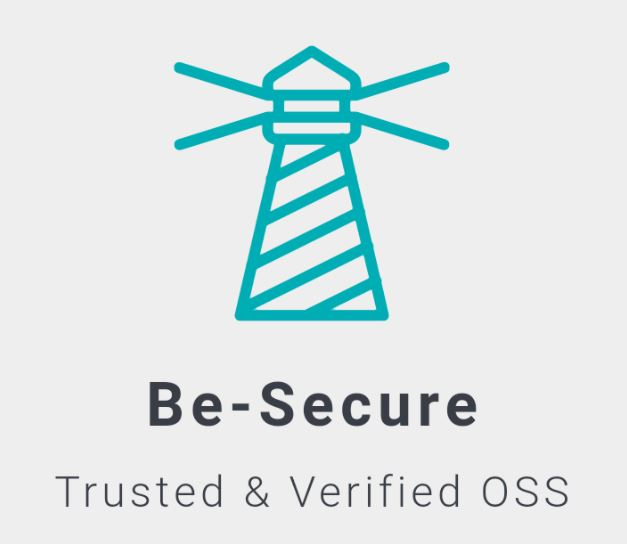

·         See if you can justify the content in the pages, currently it is all left aligned. The aesthetics of the page can be enhanced by making the content justify aligned. This should be done across all pages.

·         Under What is Be-Secure open source security stack , please include mostly in the following statement – “This aspect is not factored in during selecting an open source technology ”

·         In the same section, reword “ BeSman envs” as “BeSman environments”
'

	https://github.com/Be-Secure/cactus
	https://github.com/Be-Secure/fabric
	https://github.com/Be-Secure/cello
	https://github.com/Be-Secure/caliper
	https://github.com/Be-Secure/aries
	https://github.com/Be-Secure/besu
	burrow
	https://github.com/Be-Secure/django-DefectDojo
	https://github.com/Be-Secure/stix-shifter
	https://github.com/Be-Secure/opendxl-ontology
	
	NIST SCAP v2 https://github.com/OpenSCAP/openscap
	Hyperledger Indy  https://github.com/hyperledger/indy-sdk
	Hyperledger Sawtooth https://github.com/hyperledger/sawtooth-core
	Hyperledger IROHA https://github.com/hyperledger/iroha
	Hyperledger URSA https://github.com/hyperledger/ursa
	SAMM   https://github.com/OWASP/samm
	OWTF https://github.com/owtf/owtf
	Security Shepherd Top Ten   https://github.com/OWASP/SecurityShepherd

	https://github.com/Be-Secure/indy-sdk
	https://github.com/Be-Secure/sawtooth-core
	https://github.com/Be-Secure/iroha
	https://github.com/Be-Secure/ursa

<a href="https://vimeo.com/570839886/50aeb9d751" target="_blank">Demo</a>

·         Please remove the following content from the section “What is Be-Secure open source security stack” – “There are lot many open source tech stacks out there in the world today. An individual will have a wide variety of open source technologies to choose from for their project needs. Each open source technology has its own security stature. Often this may not be factored in while deciding on the tech stack for an open source project. Considerable effort is spent during the development phase to address the security issues. This effort can be reduced if the security of open source technologies / open source project is identified and addressed before it is being consumed.

<!DOCTYPE html>
<html lang="en">
<head>
<title>CSS Website Layout</title>
<meta charset="utf-8">
<meta name="viewport" content="width=device-width, initial-scale=1">

</head>
<body>

    <table><td></td>
  <td><h1>Be-Secure</h1></td>
  </table>
  

      

</body>
</html>

