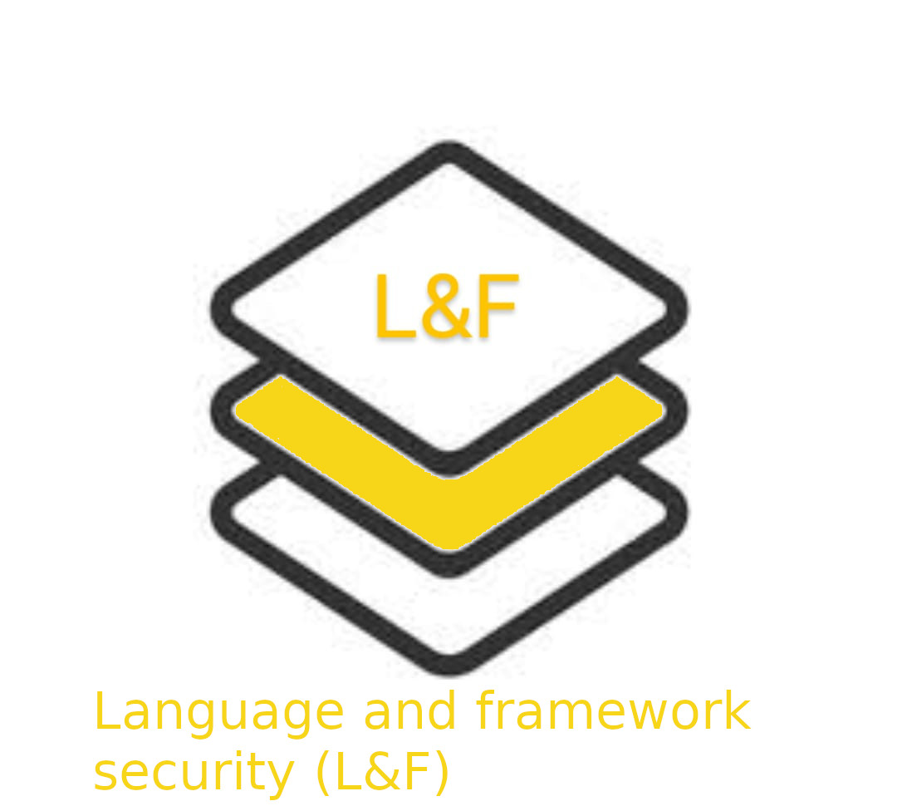

 

 <b>It is an umbrella of open source security(OSS) projects and utilities tracked and maintained by the Be-Secure community. </b>
 

    The projects are focused on enabling open-source communities to enhance security for their open-source projects and help build a security community around open-source. There is a growing trend of open-source adoption today and this growth is driving creation of lot more open-source components. It is essential to have a mechanism and community to focus on security of these open-source software components.

[Click here](./besec_info/Be-secure_gettingstr.md) to know more about Be-Secure

    
#### [OSS Projects we track](./besec_info/tracked_projects.md)
    
We have identified a set of open source projects that we will be tracking and assessing their security posture as a community activity. This list will be a growing list where new projects gets added as we move forward. 

#### [Be-Secure Community Edition Security Assessment](./besec_info/Security_assessment.md)
    
We have defined a seven stage approach to assess and enhance the security posture of open source projects. Each stage is defined with a definitive objective and all together they will help strengthen the security posture of open source projects in a consistent manner. 
    

#### [Be-Secure Open Source Security Tech Stack ](./besec_info/tech_stack_details.md)

Be-Secure open source security stack is a classification of technologies for enabling open-source developers to identify & leverage suitable BeSman environments that have been security tested by the Be-Secure open-source community.

The different open-source security tech stacks identified based on their characteristics and type of usage are –
    
<table style="border: none; ">
    <tr style="border: none background-color:yellow;"><td style="border: none">
    <a href=""> </td><td style="border: none"></a>
     
    </td></tr> 
<tr style="border: none" ><td style="border: none"></a></td><td style="border: none"></td></tr>
<tr style="border: none" ><td style="border: none; padding: 1px"></a></td></tr>
    </table>

    
    
#### [OSS Projects we contribute](./besec_info/Project_contribute.md)
    
We have defined and developed a command line utility known as BeSman. We are contributing this utility to the community and will continue to help enhance its capabilities as we move on.
    
    
 
 

#### [Becoming a Be-Secure community member](./besec_info/More_info.md)

This section will help you to become a community member and how you stand to benefit from being a community member.

    
    

    
    